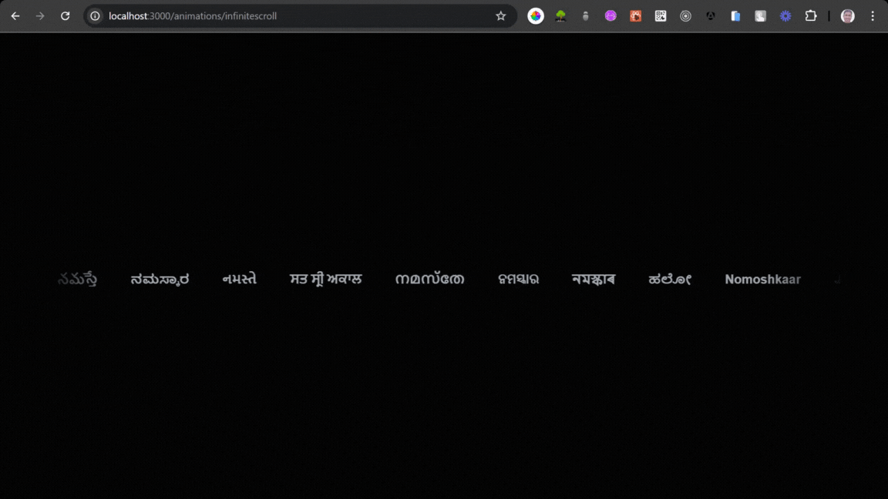
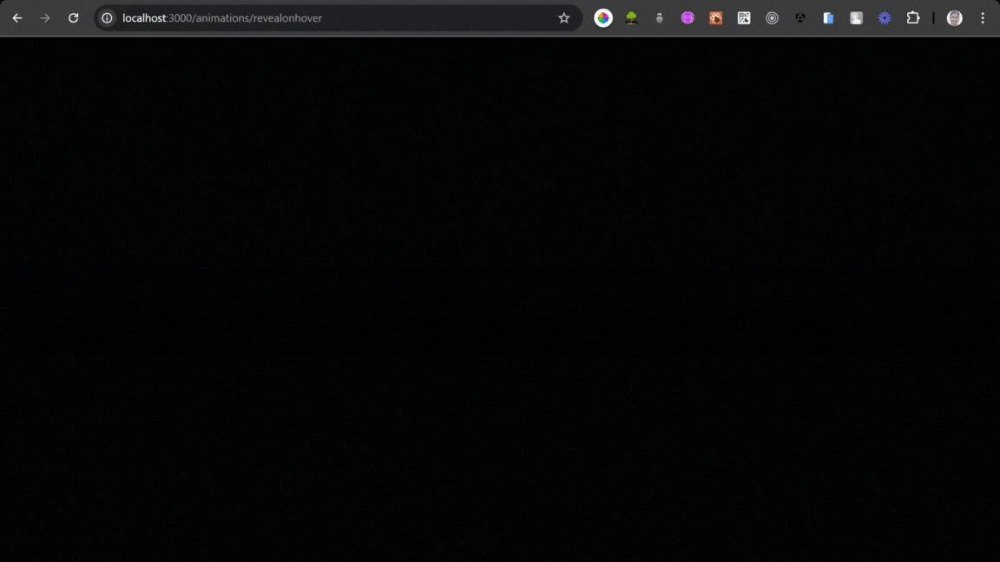

# Next.js Animations Project

This is a practice project built with [Next.js](https://nextjs.org/), [TypeScript](https://www.typescriptlang.org/), and [Tailwind CSS](https://tailwindcss.com/) to explore and implement CSS animations using Tailwind's utility classes & custom classes.

## Features

- **Animations**: Smooth and responsive animations created with Tailwind CSS, adding visual engagement to the interface.
- **Next.js**: A powerful framework for building optimized, server-rendered applications with React.
- **TypeScript**: Enhances JavaScript with type definitions for improved code quality and development speed.
- **Tailwind CSS**: Utility-first CSS framework that allows for fast styling and customization.

### Animation Previews

#### Infinite Scroll Animation

This smooth scrolling animation loops indefinitely, ideal for displaying continuous content.

#### Reveal Animation on Hover

This animation reveals content when hovered, adding interactivity and highlighting.

